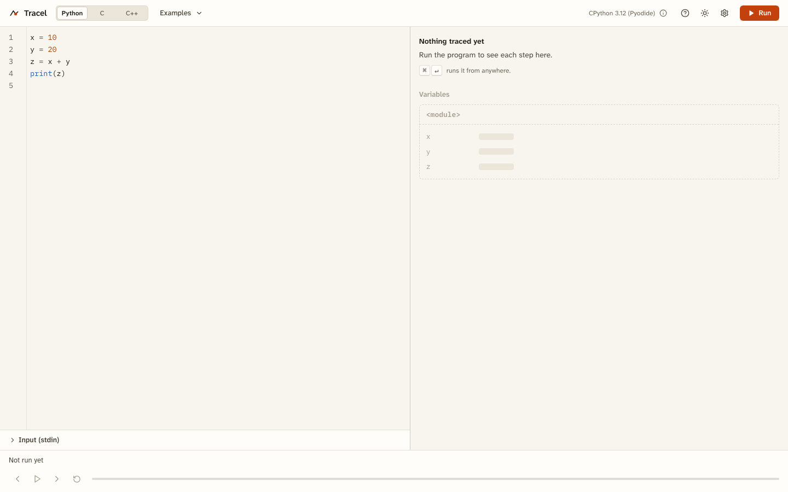
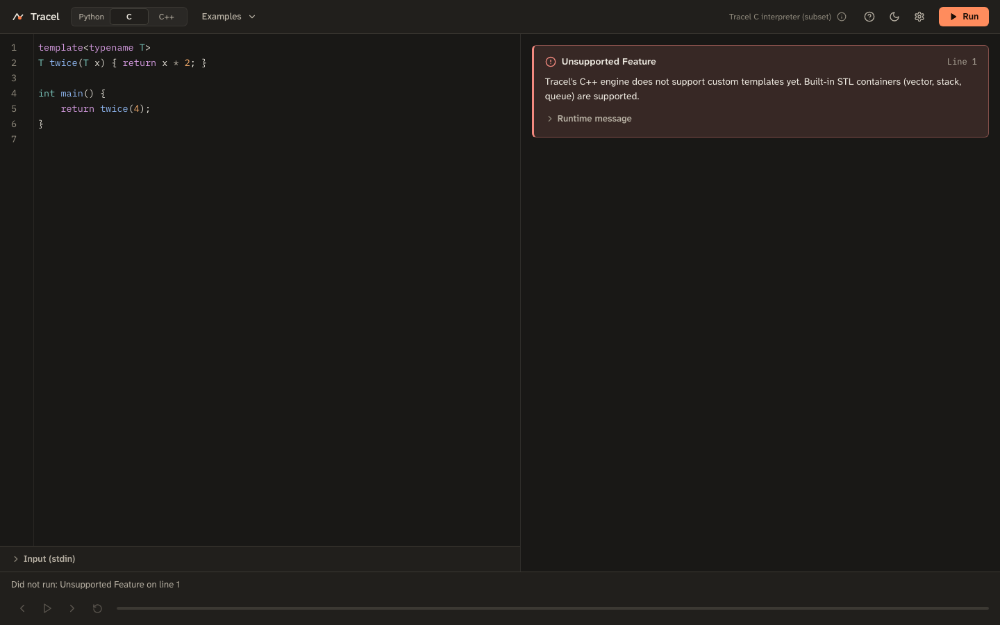

# Tracel

Tracel runs a Python, C or C++ program in the browser and lets you step through it line by line while it shows the call frames, variables and data structures at each step.




## Running it

Requires Node.js 18 or later.

```bash
npm install
cp .env.example .env     # optional: add GEMINI_API_KEY for the AI features
npm run dev              # development server on http://localhost:5173
npm test                 # unit and golden tests
npm run build            # type-check and production build
npm run check:contrast   # WCAG contrast check for both themes
```

`node scripts/capture-screenshots.js` serves the last build, so run `npm run build` first. It captures every viewport in both themes into `qa-screenshots/`.

## Languages and limits

**Python** runs CPython 3.12 (Pyodide) in a Web Worker, traced with `sys.settrace`. Your program may import only `math`, `random` (seeded with 0), `collections`, `heapq`, `bisect`, `itertools`, `functools`, `operator`, `string`, `re`, `dataclasses`, `typing`, `enum`, `copy`, `statistics`, `fractions`, `decimal`, `array`, `time` and the `tracel` helper module (`tracel.Stack`, `tracel.Queue`); anything else raises an `ImportError`. After Pyodide loads, the worker removes `fetch`, `XMLHttpRequest`, `WebSocket`, `EventSource` and `importScripts`.

**C and C++** run on Tracel's own interpreter in the browser. It covers a subset: loops, functions and recursion, references, arrays, pointers and pointer arithmetic, structs, `malloc`/`free`, `new`/`delete`, `printf`/`scanf`, `std::cout`/`std::cin`, `std::string`, `std::vector`, `std::stack`, `std::queue`, `sort` and `swap`. Out-of-bounds access, null dereference, use-after-free, double free, uninitialized reads, division by zero, popping an empty container and runaway recursion stop the run on the offending line. Classes, templates, enums, exceptions and multi-dimensional arrays are not supported by the interpreter.

Every run stops after 5,000 steps by default (up to 20,000 in Settings), and a watchdog ends any Python run that takes longer than 8 seconds.

## AI features (Gemini)

With a `GEMINI_API_KEY` set, Tracel can use Google Gemini in two ways:

- **AI explanations** (Settings → AI explanations, off by default): after a real run, Gemini writes a plain-English sentence for each step, suggests how to draw data structures and explains errors. It only adds text; values, state and step count always come from the real engine.
- **AI simulation for C and C++**: when the interpreter can't run a program (for example it uses a class or a template), Gemini traces it instead and the trace panel says **AI-simulated (Gemini)**. Settings can also make Gemini simulate every C/C++ run, or turn the fallback off.

How simulation works: Gemini returns a list of operations per executed line (declare, assign, alloc, write, push, call, return, error…) as structured JSON. Tracel validates it, retrying once if it's malformed, then replays the operations on its own memory model, which checks every operation. If an operation is impossible (an unknown block, a write past the end, a line that doesn't exist) the trace stops there with an error instead of guessing. AI traces are capped at 500 steps by default (Settings).

**Accuracy:** a simulated trace is the model's reading of the program, not a real execution, and can occasionally be wrong. Use the interpreter's result where it exists.

Setup:

1. Get a key at [Google AI Studio](https://aistudio.google.com/apikey).
2. `cp .env.example .env` and set `GEMINI_API_KEY`. Optionally set `GEMINI_MODEL` (default in `src/engine/adapters/ai/config.ts`).
3. Restart `npm run dev`.

The key stays on the server. In development the Vite dev server answers `POST /api/trace`; in production deploy `api/trace.ts` as a serverless function (Vercel style) with `GEMINI_API_KEY` in its environment. Both share `src/server/traceHandler.ts`, which validates input (language, source up to 20,000 characters), rate-limits each IP to 20 requests a minute and times out slow calls. Results are cached in the browser, so re-running the same code doesn't call the API again.

## Keyboard shortcuts

| Action | Keys |
|---|---|
| Run | ⌘ Enter / Ctrl Enter |
| Play or pause | Space, or ⌘ . / Ctrl . |
| Step forward / back | → / ← (outside the editor), F10 / Shift F10 |
| First / last step | Home / End |
| Restart | R |
| Playback speed | 1 to 5 |
| Toggle breakpoint | F9 |
| Shortcut list | ? |

## Themes

Light, dark, or follow the system setting, chosen from the top bar or Settings. All colors are tokens in `src/styles/tokens.css`; components never use raw colors.

## Architecture

See [ARCHITECTURE.md](ARCHITECTURE.md). Examples live in `src/features/examples/registry.ts`; new languages implement `LanguageAdapter` in `src/engine/adapters/types.ts`.
